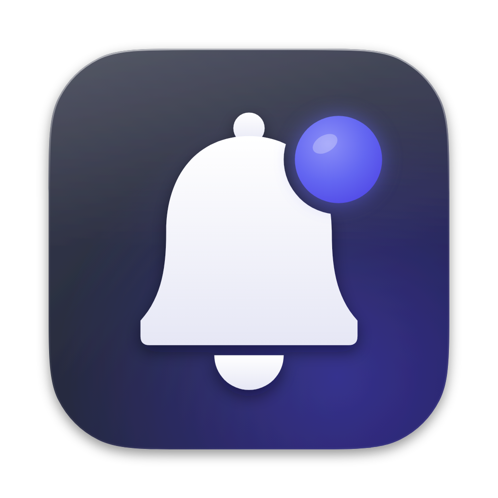

# Beckon — answer Claude Code from anywhere on your Mac

[](https://github.com/bhattji007/beckon/releases/latest) [](LICENSE) 

When a Claude Code session needs you — a permission prompt, a question, a finished task — Beckon shows a small card on top of whatever you are doing, even a fullscreen app. Answer it there. Focus returns to your work. Works with every terminal, the VS Code and JetBrains extensions, and Claude Desktop; handles many sessions and subagents at once; installs with one click and can never make Claude Code worse.

<p align="center"></p>

## Install

Download the latest `Beckon-x.y.z.dmg` from [Releases](https://github.com/bhattji007/beckon/releases/latest), drag Beckon to Applications, open it, click **Install hooks**. Done. The onboarding window shows exactly what is added to `~/.claude/settings.json`, keeps your existing hooks, backs the file up, and "Remove hooks" undoes it.

Until the releases are signed with a Developer ID, macOS may say the app cannot be verified: System Settings → Privacy & Security → **Open Anyway**. Or build it yourself in one command:

```sh
git clone https://github.com/bhattji007/beckon && cd beckon && ./install.sh
```

## How it works

```
Claude Code ──hook──▶ ~/.beckon/bin/beckon-hook ──unix socket──▶ Beckon.app ──▶ card ──▶ your click/keys ──▶ decision JSON back to the hook
```

Permission requests and questions are answered through the hook reply. Typed follow-ups go through Claude Code's per-session messaging socket. If Beckon is not running the shim exits in a millisecond and Claude's normal prompt appears. Full details: [`app/README.md`](app/README.md), architecture and verified Claude Code facts: [`SPEC.md`](SPEC.md).

## Contributing

Issues and PRs are welcome. Start with [`CONTRIBUTING.md`](CONTRIBUTING.md) (dev setup takes two commands, no Xcode project) and the `good first issue` label. The overlay design is open for improvement: [`app/DESIGN-BRIEF.md`](app/DESIGN-BRIEF.md) describes the contract. Security reports: [`SECURITY.md`](SECURITY.md).

## Project layout

**Status (2026-10-02):** v0.9.0 public beta. Unsigned until the Developer ID arrives (see `DISTRIBUTION.md`).


- `app/` — the macOS app (Swift + a C shim), `app/README.md` behaviour reference, `app/DESIGN-BRIEF.md`, `app/tests/smoke.sh`.
- `release/`, `.github/workflows/release.yml`, `DISTRIBUTION.md` — build, sign, notarize, publish. `site/` — landing page.
- `SPEC.md` — the structured idea: problem, principles, verified hook capabilities, architecture, transports, plug-and-play install, multi-agent model, security, MVP cut.
- `videos/` — six UI/UX mockup videos (same story in each, so they compare fairly). `00-all-drafts.mp4` plays them back to back.
- `drafts/*.html` — the source of each video. Open any file with `#play` appended in a browser to watch it live.
- `render/` — the shared harness (`harness.css/js`), the brief all drafts followed (`BRIEF.md`), the renderer (`render.mjs`), and a 12-frame contact sheet per draft.

Re-render everything: `npm i && npx playwright install chromium && node render/render.mjs` (one draft: `node render/render.mjs drafts/02-hud.html`).

| # | Draft | Idea |
|---|---|---|
| 1 | Toast Stack | macOS-style cards top-right, actionable inline, fold when stacked |
| 2 | HUD | Spotlight-style center palette, keyboard-first, explicit queue |
| 3 | Edge Rail | Always-on rail with a chip per session; panel slides out on demand |
| 4 | Notch Island | Lives in the notch, Dynamic-Island expand/contract |
| 5 | PiP Agents | A tiny live transcript window per session, lights up when it needs you |
| 6 | Cursor Bubble | Alert anchored to the mouse cursor, shrinks to a dot if ignored |
